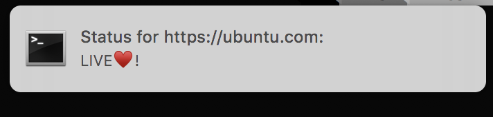

# toop

Toop is a Python library that monitors that status of a website on Mac


## Features

- Recieve realtime updates on the status of a website i.e. whether it is LIVE OR DOWN
- Desktop Notifications such that you dont have to momentarily check the terminal for the messages
- Input of the number of times you would want toop to visit the website while returning its status

## Screenshot of Notification



## Installation

- Run the command :

```
pip install toop
```

## Using toop

In the python shell :

```
>>> from toop import monitor
>>> monitor.monitor("the website to monitor", the intervals to monitor the website)
```

Refer to the gif for an example of this Usage!


## Contributing Guide

If you would like to contribute to this project, feel free ♥️ . Kindly follow the guide below:

First Clone the project: 

```
git clone https://github.com/Genza999/toop.git
```

cd into the project:

```
cd toop
```

For the changes you are to make, first create a new branch for. For example someone
who is to add tests would first have to create a new branch like this :

```
git checkout -b "add-tests"
```

After adding your changes then you commit

```
git add *
git commit -m "add tests"
```

Then you push to create a PR with the branch

```
git push origin head
```

## Authors

Contributers can be found [here](https://github.com/Genza999/toop/graphs/contributors)
